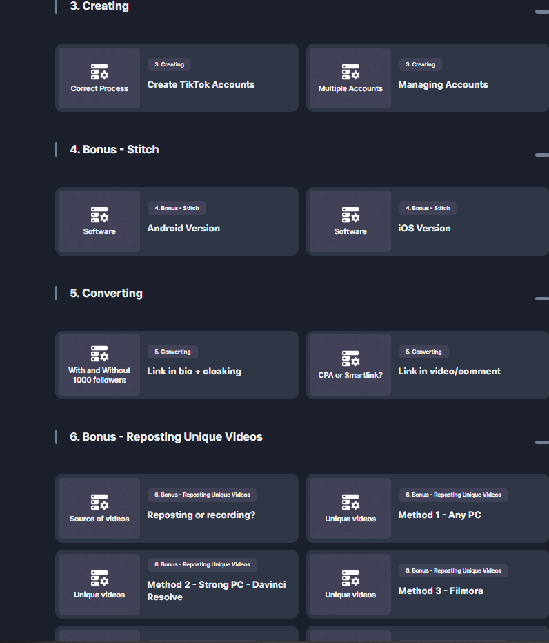

# TikTok-USA-Targeting

Are you frustrated with TikTok's algorithm? Do you struggle with:

* **General FYP feeds** that don't feel local to your target region?
* **Shadowbans** that cripple your reach?
* **Zero views** or limited engagement?
* **Struggling to utilize features like the stitch method?**
* **Unclear solutions** that rely on incomplete information?

**You're not alone.** Many users face these challenges, often relying on sketchy, incomplete, or even false advice about proxies, VPNs, and SIM cards. While these might be part of the solution, they are **not the whole picture.**  

Just using a 4G proxy and a SIM card from your target country isn't enough to convince TikTok you are a genuine, local user. **You're likely still getting a generic FYP feed instead of the hyper-local content that a native user in, say, Dallas, Texas would experience.** You need to go deeper.

## Introducing the "TikTok Geotargeting" Course

My comprehensive course will teach you **exactly how to trick TikTok** into treating you like a normal user in your chosen target country.  We'll go beyond the usual superficial tips and reveal the **hidden device configurations** that will make you virtually invisible to TikTok's detection mechanisms.

**This is not just about proxies and SIM cards. It's about complete device camouflage.**

## What You'll Learn:

This course provides detailed, step-by-step instructions (with video and image tutorials) to achieve true TikTok targeting:

*   **Master Device Configuration:** Learn the precise settings and techniques to make your device appear as a genuine user in your target region (USA or any other country).
*   **Multi-Account Management:** Discover how to create and manage multiple TikTok accounts without triggering red flags from the platform.
*   **Video Optimization for the Algorithm:** Master various techniques to alter your videos and bypass TikTok's detection methods:
    *   Online tools
    *   DaVinci Resolve
    *   Filmora
    *   FFMPEG (with complete code snippets)
*   **Adult Content Strategies (Bonus):** Learn how to upload adult content without getting guideline strikes, including:
    *   Content modification techniques
    *   Sourcing material effectively
*   **Conversion & Basic Cloaking:** Learn how to use links effectively in your TikTok bio, comments, and videos, including basic cloaking techniques.
*   **Troubleshooting:** Address common issues with views, guidelines, and platform restrictions, including practical fixes.
*   

## What's Included?

*   **Exclusive Access to the Online Course:** A private URL (only for buyers) leading to comprehensive video tutorials, images, and step-by-step guides.
*   **Direct Contact with Me:**  Ask questions directly and receive personalized assistance.

  
  
  

## Common Questions Answered:

**Q: Can TikTok fix targeting?**

**A:** Yes, they *can*, but the methods taught in this course mimic the behavior of a normal user so effectively that our location is extremely hard to detect.

**Q: Can TikTok fix stitch methods?**

**A:** They can, and they will try. However, this course includes advanced techniques to prevent TikTok from fixing it for *our users*. When others struggle, you'll have the working solution. Note, we cannot guarantee they will not stop pushing these videos in the algorithm.

**Q: Show me your money!**

**A:** This course is **not** a "get rich quick" scheme. It teaches you the **correct targeting methods** and how to bypass TikTok's detection, along with bonus content. How you monetize it is up to you.

**Q: What can I do with this method?**

**A:** The possibilities are endless! You can:
    *   Promote CPA offers.
    *   Promote OnlyFans models.
    *   Start dropshipping.
    *   Sell Clickbank or your own products.
    *   The power is yours!

**Q: Why are you selling this?**

**A:** For money. TikTok is a massive platform with huge opportunities. Sharing this knowledge with a few more people won't oversaturate the market or affect my own success.

**Q: Is it an online website with videos and tutorials?**

**A:** Yes, but the URL is kept private to prevent unauthorized access.

**Q: Do you guarantee I will make money?**

**A:** No. This is not a money-making course. It teaches you how to gain *access* to the right audience, but your success depends on *what* you do with that access.

**Q: Do you guarantee that my videos will get views?**

**A:** No.  Targeting is crucial, but the *quality* of your content is paramount. TikTok is not a magic box. Even with perfect targeting, unengaging content will not reach a large audience. I recommend exploring less saturated markets like the UK or Brazil if your content is struggling in the US.

## Ready to Unlock Your TikTok Potential?

Stop fighting the algorithm and start playing by the rules – *your own*.  My course will provide the edge you need to succeed on TikTok.

